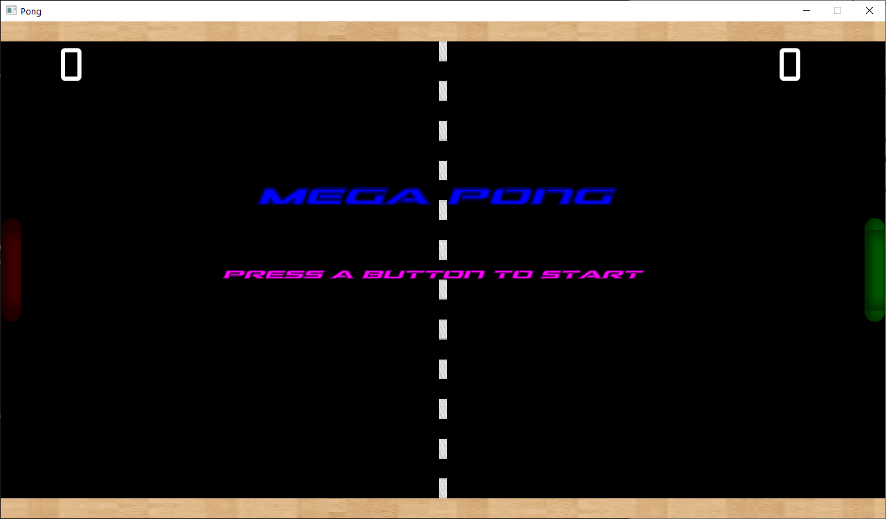

# Mega Pong
Mega Pong is a [Pong-like](https://en.wikipedia.org/wiki/Pong) game based on [LearningOpenGL Breakout game tutorial](https://learnopengl.com/In-Practice/2D-Game/Breakout).  
 

---
 

Currently, Mega Pong **only supports 2-player games** (no computer AI).  

|  |
|:--:|
| <b>Starting page</b>|

Gamepad and keyboard controls can be used.   

- Left player keyboard control - WASD  
- Right player keyboard control - Arrow keys  
 

|  |
|:--:|
| <b>Game in action</b>|

A player wins when it reaches 5 goals.

Work in progres ;-)
